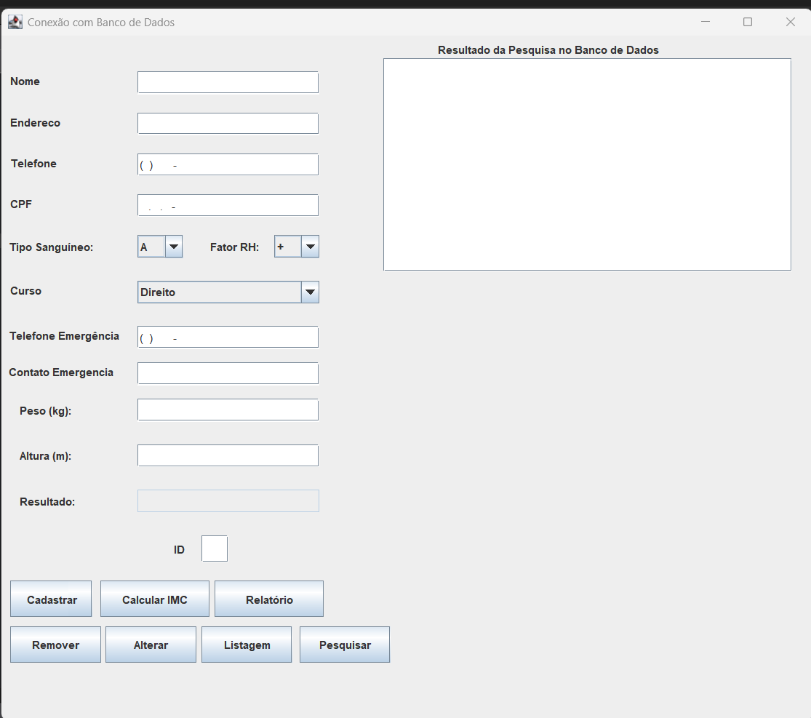
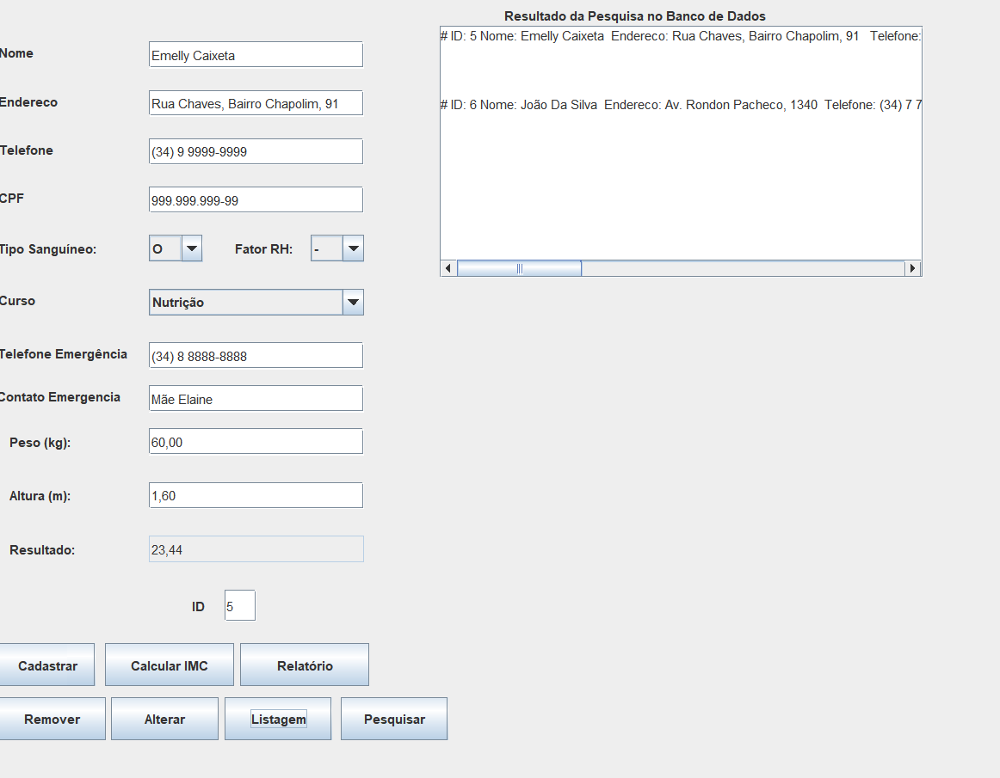

# 📋 Sistema de Cadastro de Pessoas – Java + MySQL

Este projeto foi desenvolvido como atividade acadêmica com o objetivo de atender à demanda de uma empresa que necessita de um **sistema básico de cadastro de pessoas**, permitindo a manipulação eficiente de dados como **nome, endereço e telefone**. A aplicação utiliza **Java com Swing** para a interface gráfica e **MySQL** para persistência dos dados.

---

## 🛠️ Tecnologias Utilizadas


- Java 8+  
- Swing (Java GUI)  
- MySQL 8+  
- JDBC (Java Database Connectivity)

---

## 🎯 Funcionalidades

- 📝 Cadastro de pessoas com nome, endereço e telefone  
- 🔄 Atualização de dados existentes  
- ❌ Remoção de registros  
- 🔍 Busca individual por ID  
- 📋 Listagem completa de registros

---
## 🖥️ Estrutura do Projeto

```text
📁 src/
├── Principal.java               // Classe principal que inicializa a interface
├── CadastroDePessoasBD.java     // Classe de conexão e manipulação de dados (inserir, atualizar, remover)
├── InterfaceGrafica.java        // Interface GUI que interage com o usuário
└── Pessoa.java                  // Classe modelo representando uma pessoa

```

---

## 📄 Interface Gráfica

A interface foi desenvolvida com **Java Swing**, contendo:

- Campos de texto para:
  - ID
  - Nome
  - Endereço
  - Telefone
  - CPF
  - Tipo Sanguíneo
  - Fator RH
  - Curso
  - Telefone de Emergência
  - Contato de Emergência
  - Peso
  - Altura
  - IMC


- Botões:
  - Cadastrar
  - Calcular IMC
  - Relatório
  - Remover
  - Alterar
  - Listagem
  - Pesquisar

A interação com o banco é feita por meio da classe `CadastroDePessoasBD`, responsável por executar os métodos de manipulação de dados.

---

## 🗃️ Banco de Dados

O sistema utiliza o **MySQL**. A estrutura da tabela `pessoa` é definida conforme abaixo:

```sql
CREATE TABLE pessoa (
    id INT PRIMARY KEY AUTO_INCREMENT,
    nome VARCHAR(45),
    endereco VARCHAR(45),
    telefone VARCHAR(45),
    cpf VARCHAR(14),
    tiposanguineo VARCHAR(5),
    fatorrh VARCHAR(3),
    curso VARCHAR(100),
    telefoneemergencia VARCHAR(20),
    contatoemergencia VARCHAR(100),
    peso DOUBLE,
    altura DOUBLE,
    imc DOUBLE
);
```
## ⚠️ Importante

Atualize o nome do banco no código (atualmente `nomebd`) conforme sua configuração local.

---

## ⚙️ Como Executar

1. Certifique-se de que o MySQL está instalado e ativo.  
2. Crie o banco de dados e a tabela `pessoa` com o script acima.  
3. Configure o acesso ao banco de dados no arquivo `CadastroDePessoasBD.java`:

```java
private final String URL_Bancodedados = "jdbc:mysql://localhost:3306/nomebd";
private final String usuario = "root";
private final String senha = "admin";
```
4. Compile e execute a classe `Principal.java`.

---

## 🧪 Exemplos do Sistema

### 🧾 Tela de Cadastro  
Permite inserir novos registros de forma intuitiva.



---

### 🔄 Atualização   
Alterar dados existentes registros é simples e direto.


---

### 📋 Listagem de Registros  
Visualização completa de todas as pessoas cadastradas.



---

### 👨‍🎓 Créditos
Projeto desenvolvido por Emelly Vitoria Caixeta e Orientado pela professora Angela Abreu para a disciplina de Programação Orientada a Objetos II - Anhanguera de Uberlândia 


